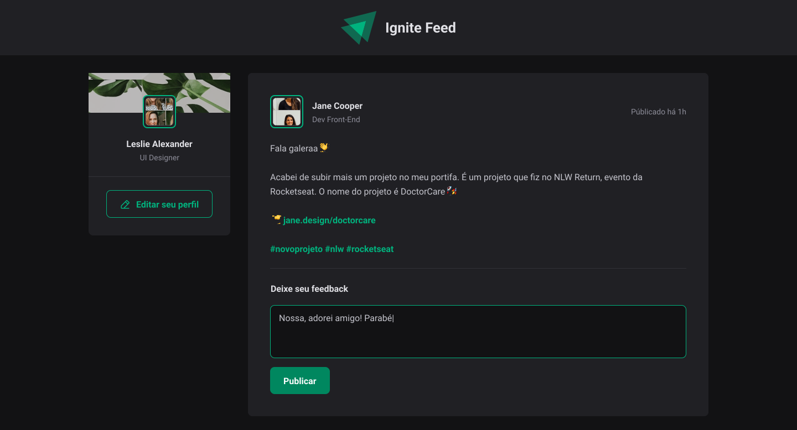

<h4 align="center">

</h4>

<h4 align="center">
    <p align="center">
      <a href="#-about">About</a>&nbsp;&nbsp;&nbsp;|&nbsp;&nbsp;&nbsp;
      <a href="#-technologies">Technologies</a>&nbsp;&nbsp;&nbsp;|&nbsp;&nbsp;&nbsp;
      <a href="#-how-to-run-the-project">Run</a>&nbsp;&nbsp;&nbsp;|&nbsp;&nbsp;&nbsp;
      <a href="#-info">Info</a>&nbsp;&nbsp;&nbsp;|&nbsp;&nbsp;&nbsp;
      <a href="#-license">License</a>
  </p>
</h4>

<h1 align="center">
  
</h1>

## 🔖 About

O **Ignite Feed** é um projeto que tem como objetivo de imitar o feed de rede social. O projeto é desenvolvido em linguagem de programação **Javascript** e utiliza o framework **ViteJS**.

[Layout](https://www.figma.com/community/file/1113573231685349036)

## 🚀 Technologies

- [ReactJS](https://reactjs.org/)
- [TypeScript](https://www.typescriptlang.org/)
- [Vitejs](https://vitejs.dev/)
- [PhosphorIcons](https://phosphoricons.com/)

## 🏁 How to run the project

```bash
# Clone the repository
git clone https://github.com/rafinhaa/ignite-feed.git
cd ignite-feed

# Install the dependencies
npm install

# Start the application
npm run dev
```

## ℹ️ Info

## 📝 License

[MIT](LICENSE)

**Free Software, Hell Yeah!**
